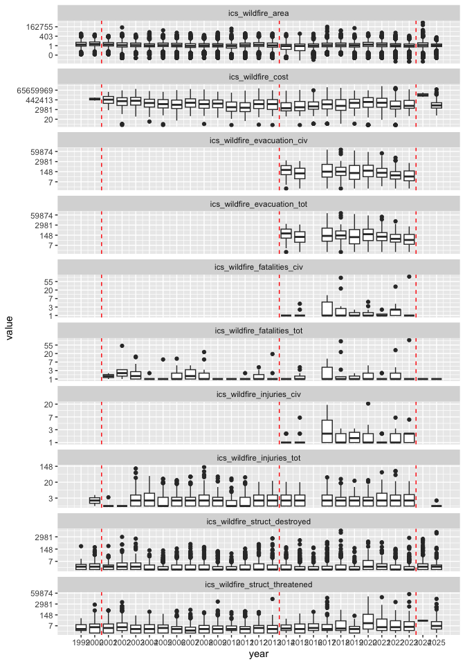

# QC

Summarize some stats by year to see if we have any glaring issues from
the varying file formats over time.

Known issues:

-   the following are not available before 2014:
    -   evacuations
    -   civilian fatalities
    -   civilian injuries
-   the codes used to identify fatalities, injuries, and evacuations
    were not available in the 2016 data set

